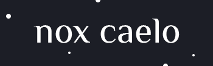

<a href="#" target="_blank" rel="noopener"></a>

# nox-caelo

A very basic text-adventure/visual novel style game created by Evangeline Papanicola, using [Inkle's Ink](https://www.inklestudios.com/ink/) scripting language and [Vue.js](https://vuejs.org/).

##Credits

Special thanks to AJ @ahosgood for all the coding help!

Open source imagery used:

- [Mountain Dusk Parallax Background by Ansimuz on itch.io](https://ansimuz.itch.io/mountain-dusk-parallax-background)
- [SunnyLand Forest by Ansimuz on itch.io](https://ansimuz.itch.io/sunnyland-forest)
- [Pixelart Game Backgrounds by MobileGameGraphics on GameDev Market](https://www.gamedevmarket.net/asset/pixelart-game-backgrounds/)
- [Shikashi's Fantasy Icons Pack by Shikashiassets on itch.io](https://www.gamedevmarket.net/asset/pixelart-game-backgrounds/)

Shoutout to [Ashley](https://twitter.com/ashleyw633) for aaaaallll the beta testing!

## Project setup
```
npm install
```

### Compiles and hot-reloads for development
```
npm run serve
```

### Compiles and minifies for production
```
npm run build
```

### Run your tests
```
npm run test
```

### Lints and fixes files
```
npm run lint
```

### Customize configuration
See [Configuration Reference](https://cli.vuejs.org/config/).
